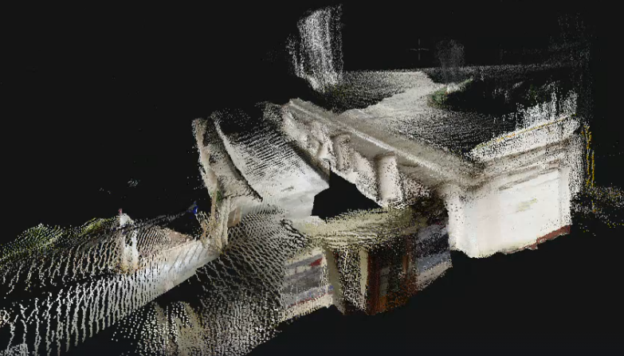

# **<h1 align="center">SPLATTERA</h1>**

Transforms a walkthrough video into a photorealistic, 
interactive 3D environment by estimating camera poses with [LoGeR](https://arxiv.org/abs/2603.03269) ( Long Context Geometric Reconstruction ) and Using two training pipelines [3D Gaussian Splatting ](https://arxiv.org/pdf/2308.04079)and [CityGS](https://arxiv.org/html/2411.00771v1)  

Colmap was used earlier for sparse point cloud and poses but Splattera replaces it with LoGeR.  
LoGeR provides a dense point cloud  directly from raw video frames in a
single forward pass.   

We are optimizing the 3D Gaussian Splatting for Large scenes.
Splattera is built on top of LoGeR that integrates SOTA  3dgs that is scale and context optimised to loger’s point cloud priors and Citygs that supports large scene reconstruction using parallel block training 

  


## Installation

Splattera supports two training pipelines — 
3DGS and CityGS  

## SETUP

### Environment
Create a single Conda environment as specified  
```bash
conda create -n splaterra python=3.11 cmake=3.14.0
conda activate splaterra
 
```
### 3DGS for Large Scenes 

### CityGaussian

```bash
git clone https://github.com/javAmeya/splaterra
cd splaterra
git checkout main
pip install -r requirements.txt
pip install gsplat
```

## Checkpoint Download

LoGeR checkpoints are hosted on [Hugging Face](https://huggingface.co/Junyi42/LoGeR).

Please place files as:
- `ckpts/LoGeR/latest.pt`
- `ckpts/LoGeR_star/latest.pt`

Example commands:

```bash
wget -O ckpts/LoGeR/latest.pt "https://huggingface.co/Junyi42/LoGeR/resolve/main/LoGeR/latest.pt?download=true"
wget -O ckpts/LoGeR_star/latest.pt "https://huggingface.co/Junyi42/LoGeR/resolve/main/LoGeR_star/latest.pt?download=true"
```

## Demo

For running LoGeR to get poses + point cloud, please directly refer to:

- [`demo_run.sh`](demo_run.sh)

## Training

Splaterra supports two training pipelines on top of LoGeR's output:

- **Vanilla 3D Gaussian Splatting** — [`tinysplat/train.py`](tinysplat/train.py)
  Turns LoGeR's points and camera positions straight into a normal 3D scene, best for regular-sized scenes shot in one go. Uses LoGeR instead of Colmap
- **CityGaussian** — [`train_citysplat.py`](train_citysplat.py)
  Block wise large scene pipeline - Splits a huge scene into a grid of blocks , builds a rough version of scene first and then finetunes it

## Diagnostics

- [`diagnostic_reproject.py`](diagnostic_reproject.py) — It takes a camera from video and projects 3D points through it , if they trace the walls and the floors correctly then the cameras position is right  
It is used to check the correctness of pose 
  
- [`demo_viser.py`](demo_viser.py) —  Runs LoGeR on your video and opens an interactive 3D viewer  where you can see the  whole reconstructed scene

## Conversion to ply 

**3DGS**  
- [`convertply.sh`](convertply.sh) — convert pth to ply  
 
 bash convertply.sh `iteration`.pth

**CityGS**
- [`ckpt_to_ply.py`](ckpt_to_ply.py) — export a trained checkpoint's
  Gaussians to `.ply`  


## Evaluation

For evaluation instructions, please refer to:

- [`eval/eval.md`](eval/eval.md)

## Acknowledgments

Built on [LoGeR](https://github.com/junyi42/LoGeR) (itself based on
[Pi3](https://github.com/yyfz/Pi3) and [LaCT](https://github.com/a1600012888/LaCT)),
[gsplat](https://github.com/nerfstudio-project/gsplat) for differentiable
rasterization, and the original [3D Gaussian Splatting](https://github.com/graphdeco-inria/gaussian-splatting)
and [CityGaussian](https://github.com/DekuLiuTesla/CityGaussian) papers/codebases.