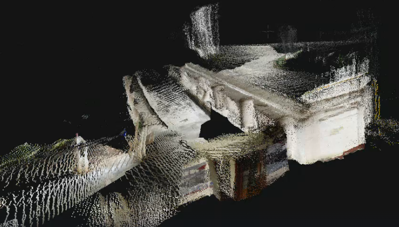

# **<h1 align="center">SPLATERRA</h1>**

Transforms a walkthrough video into a photorealistic, 
interactive 3D environment by estimating camera poses and geometry with [LoGeR](https://arxiv.org/abs/2603.03269) ( Long Context Geometric Reconstruction ) and high quality reconstruction using [3D Gaussian Splatting](https://arxiv.org/pdf/2308.04079)

 

We are optimizing 3D Gaussian Splatting for Large scenes. Wile standard 3DGS pipelines use COLMAP to obtain a sparse point cloud for Gaussian initialisation, COLMAP fails to provide accurate structural details over long, winding paths.
Splattera is builds 3DGS on top of LoGeR to optimise large scale reconstruction. LoGeR provides a dense point cloud with great structural detail directly from raw video frames in a single forward pass. 3DGS achieves photorealistic rendering of the scene.
  


## Installation

Splattera supports the 3DGS training pipeline

## SETUP

### Environment
Create a single Conda environment as specified  
```bash
conda create -n splaterra python=3.11 cmake=3.14.0
conda activate splaterra
 
```
### 3DGS for Large Scenes 

```bash
git clone https://github.com/javAmeya/splaterra
cd splaterra
git checkout main
pip install -r requirements.txt
pip install gsplat
```

## Checkpoint Download

LoGeR checkpoints are hosted on [Hugging Face](https://huggingface.co/Junyi42/LoGeR).

Please place files as:
- `ckpts/LoGeR/latest.pt`
- `ckpts/LoGeR_star/latest.pt`

Example commands:

```bash
wget -O ckpts/LoGeR/latest.pt "https://huggingface.co/Junyi42/LoGeR/resolve/main/LoGeR/latest.pt?download=true"
wget -O ckpts/LoGeR_star/latest.pt "https://huggingface.co/Junyi42/LoGeR/resolve/main/LoGeR_star/latest.pt?download=true"
```

## Demo

For running LoGeR to get poses + point cloud, please directly refer to:

- [`demo_run.sh`](demo_run.sh)

## Training

- [`tinysplat/train.py`](tinysplat/train.py) :
  Turns LoGeR's points and camera positions straight into a normal 3D scene, best for regular-sized scenes shot in one go. 
```bash
cd ~/splaterra/tinysplat
python train.py
```
## Diagnostics

- [`diagnostic_reproject.py`](diagnostic_reproject.py) — Running this file will project the LoGeR 3D point cloud onto a selected training image using the camera’s pose and intrinsics (K matrix).
It will then overlay the projected points on the real image to check whether the camera calibration, pose, and geometry are correctly aligned.
```bash
python diagnostic_reproject.py \
    --predictions <PATH_TO_LOGER_PREDICTIONS.pt> \
    --frame-name <FRAME_NAME> \
    --image <PATH_TO_ORIGINAL_IMAGE> \
    --out <OUTPUT_OVERLAY.png>
  ```
  
- [`demo_viser.py`](demo_viser.py) —  Runs LoGeR on your video and opens an interactive 3D viewer, where you can see the  whole reconstructed scene.

## Conversion to ply 


- [`convertply.sh`](convertply.sh) — convert .pth output to .ply file.
 
 ```bash 
 convertply.sh `iteration`.pth
 ```


## Evaluation

For evaluation instructions, please refer to:

- [`eval/eval.md`](eval/eval.md)

## Acknowledgments

Built on [LoGeR](https://github.com/junyi42/LoGeR) (itself based on
[Pi3](https://github.com/yyfz/Pi3) and [LaCT](https://github.com/a1600012888/LaCT)),
[gsplat](https://github.com/nerfstudio-project/gsplat) for differentiable
rasterization, and the original [3D Gaussian Splatting](https://github.com/graphdeco-inria/gaussian-splatting)
papers/codebases.